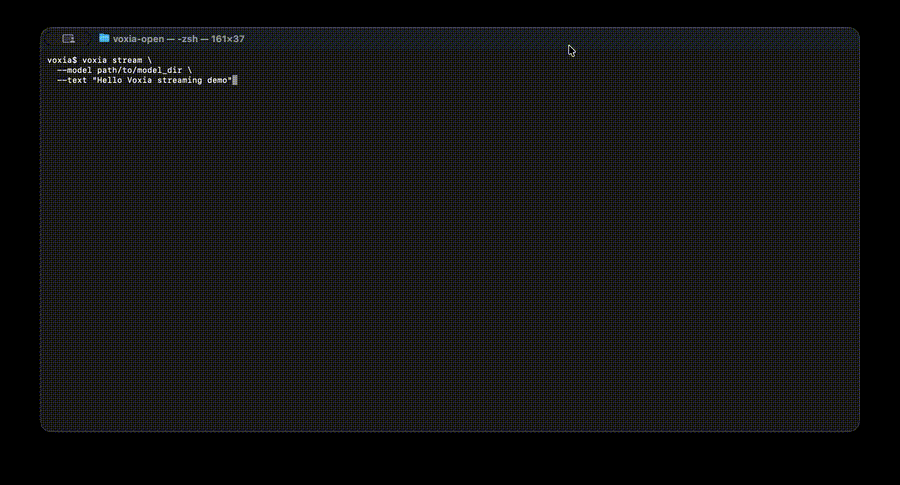
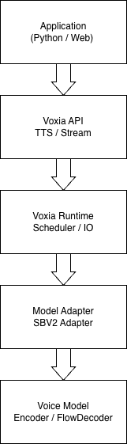

# Voxia Open


English | [日本語](README_ja.md)

**A lightweight open-source runtime for building real-time Voice AI applications.**

Voxia Open is an experimental open-source runtime for real-time Voice AI systems.

---
## Features

- SBV2 compatible model loading
- Local inference runtime
- Streaming text-to-speech
- Python API
- Command Line Interface
- HTTP API server
- Benchmark tools
- Modular runtime architecture

---
## Installation

```bash
git clone https://github.com/voxia-ai/voxia-open
cd voxia-open

python3 -m venv .venv
source .venv/bin/activate

pip install -U pip
pip install -e .
```

---
## Requirements
Python 3.9+
<br>PyTorch 2.0+

---
## Quick Start
```python
from voxia import TTS

tts = TTS.load("/path/to/model_dir")

wav, sr = tts.speak("Hello from Voxia Open")
```

---
## CLI
Voxia Open provides a simple command line interface.

Generate speech:
```bash
voxia speak \
  --model /path/to/model_dir \
  --text "Hello Voxia" \
  --out output.wav
```

Streaming generation:
```bash
voxia stream \
  --model /path/to/model_dir \
  --text "Streaming demo"
```

Benchmark:
```bash
voxia benchmark --model /path/to/model_dir
```

Demo:
```bash
voxia demo --model /path/to/model_dir
```

---
## HTTP API

Voxia Open also includes an experimental HTTP server.

Start server:
```bash
voxia serve --model /path/to/model_dir
```

Health check:
```bash
curl http://127.0.0.1:8000/health
```

Synthesize speech:
```bash
curl -X POST http://127.0.0.1:8000/tts \
  -H "Content-Type: application/json" \
  -d '{"text":"Hello from Voxia Open"}' \
  --output output.wav
```

---
## Models
Voxia Open does not include pretrained models.

You can use compatible SBV2 models.

Example model directory:
```bash
/path/to/model_dir
 ├ config.json
 ├ model.safetensors
 └ style_vectors.npy
```

---
## Demo

Example speech generation.

<p align="center">  </p>

---

## Streaming

Real-time speech generation.

<p align="center">

</p>

---
## Architecture
<p align="center">

</p>

Voxia separates the runtime from the voice model.
```bash
Application
     ↓
 Voxia API
     ↓
 Voxia Runtime
     ↓
 Model Adapter
     ↓
 Voice Model
```

This architecture allows Voxia to support multiple models in the future.

---
## Project Structure
```bash
voxia-open
├ src/voxia
│
├ examples
│
├ docs
│
├ tests
│
├ README.md
├ README_ja.md
├ LICENSE
└ pyproject.toml
```

---
## Current Status

Voxia Open is currently under active development.

The main goals of the project are:

- local speech inference runtime
- streaming audio pipeline
- model compatibility layer
- developer tools (CLI, HTTP API, benchmarking)

The current implementation focuses on building the **runtime architecture** and **developer platform** for future voice AI systems.

The native inference pipeline is still experimental and may not yet produce fully intelligible speech.

---
## Voxia Ecosystem
```bash
Voxia
├ Voxia Open   (open-source runtime)
├ Voxia Cloud  (managed API platform)
├ Voxia Studio (developer tools)
├ Voxia Edge   (lightweight runtime)
└ Voxia Core   (proprietary voice models)
```

---
## Roadmap
Phase 1

- SBV2 compatible runtime

- Streaming TTS

- CLI tools

- HTTP API

Phase 2

- Voxia Runtime engine

- Cloud integration

- improved Japanese pipeline

Phase 3

- Voxia native models

- Voice AI agents

- Edge runtime


---
## Contributing

Pull requests and issues are welcome.

Areas of interest:

- runtime architecture

- streaming improvements

- Japanese NLP pipeline

- documentation

- benchmarking

---


## License
Apache License 2.0

---


## Vision

Voxia aims to power applications such as:

- real-time voice assistants

- AI voice agents

- games

- robotics

- edge devices

**Voxia = Voice AI Operating System**