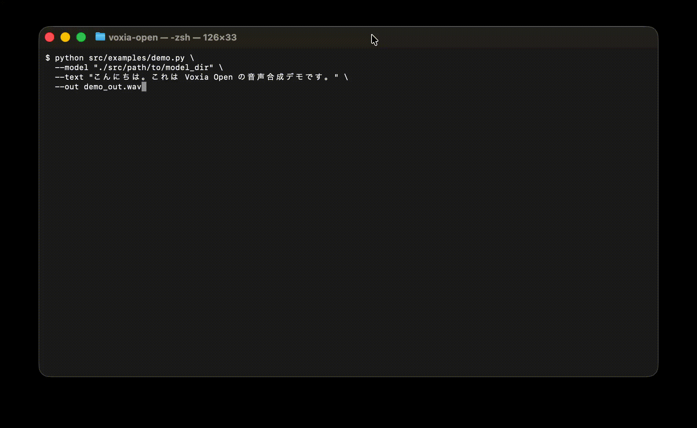

# Voxia Open

**Voxia Open** は、次世代の音声AIプラットフォーム **Voxia** の無料公開版です。

SBV2互換モデルに対応した **ローカル音声合成ランタイム**を提供し、  
リアルタイム音声アプリケーションの基盤となることを目的としています。

現在の Voxia Open は、モデルロードと波形生成経路を確認するための実験的デモを提供しています。
ネイティブ推論経路は開発中です。

Voxia は将来的に **Voice AI Operating System（音声AI OS）** を目指しています。

---

## 特徴

- SBV2互換音声合成
- ローカル推論
- ストリーミングTTS
- Python API
- ベンチマークツール
- Cloud-first を意識した Runtime 設計

---

## インストール

```bash
git clone https://github.com/voxia-ai/voxia-open
cd voxia-open
python3 -m venv .venv
source .venv/bin/activate
pip install -U pip
pip install -e .
```

## 必要環境

- Python 3.9 以上
- PyTorch 2.0 以上

## クイックスタート
```
from voxia import TTS

tts = TTS.load("path/to/model")

wav, sr = tts.speak("こんにちは。Voxia Open のテストです。")
```

## ストリーミング音声合成
```
from voxia import TTS

tts = TTS.load("path/to/model")

for chunk, sr in tts.stream("こんにちは。Voxia Open のストリーミングデモです。"):
    ...
```

## デモ
ローカルストリーミングデモ

Voxia Open は、シンプルな Python API で高品質な音声合成を実行できます。

### Quick Demo

Voxia Open で音声合成を実行する例です。
<p align="center">
  
</p>

```bash
python src/examples/demo.py \
  --model /path/to/model_dir \
  --text "こんにちは。これは Voxia Open の音声合成デモです。" \
  --out demo_out.wav
```

## モデル
Voxia Open には事前学習済みモデルは含まれていません。

互換性のある SBV2 モデルを準備し、以下の方法で指定してください。

```bash
python demo.py --model /path/to/model_dir
```


## ベンチマーク

ベンチマーク実行例
```
PYTHONPATH=./src python3 examples/benchmark.py \
  --model ./path/to/model_dir \
  --device cpu \
  --runs 5 \
  --warmup 1 \
  --threads 4 \
  --json-out voxia_bench.json
```

指標
- RTF (Real Time Factor)
<br>1.0 未満ならリアルタイムより高速

- TTFB (Time To First Byte)
<br>最初の音声チャンクが返るまでの時間


## アーキテクチャ
Voxia Open は、アプリケーションと音声モデルの間に Runtime 層を設けた設計です。
```
アプリケーション
      ↓
   Voxia API
      ↓
 Voxia Runtime
      ↓
 Model Adapter
      ↓
  Voice Model
  ```

この構造により、将来的に
- SBV2互換モデル
- Voxia独自モデル
- Cloud実行
- Edge実行

を同じAPIで扱えるようにします。

## プロジェクト構成
```
voxia-open/
├ src/
│  └ voxia/
│     ├ __init__.py
│     ├ tts.py
│     ├ runtime/
│     ├ adapters/
│     ├ formats/
│     ├ nlp/
│     ├ model/
│     └ utils/
│
├ examples/
│  ├ benchmark.py
│  └ demo_stream.py
│
├ tests/
├ README.md
├ LICENSE
└ pyproject.toml
```

## Voxia エコシステム
```
Voxia
├ Voxia Open     (無料公開版)
├ Voxia Cloud    (商用API)
├ Voxia Studio   (開発ツール)
├ Voxia Edge     (軽量実行環境)
└ Voxia Core     (独自モデル / 非公開)
```

## ロードマップ
Phase 1
- SBV2互換ランタイム
- ストリーミング音声合成
- ベンチマークツール

Phase 2
- Voxia Runtime エンジン完成
- Cloud API 統合
- より高品質な日本語パイプライン

Phase 3
- Voxia 独自モデル
- 音声エージェント
- Edge Runtime

## 現状について

Voxia Open は開発中のプロジェクトです。
<br>現在の主目的は以下です
- ローカル音声推論ランタイムの整備
- Runtime / Adapter 設計の確立
- 将来の Voxia Core / Cloud への橋渡し

## コントリビューション

Issue / Pull Request を歓迎します。
<br>特に歓迎する領域
- Runtime設計
- ストリーミング改善
- 日本語前処理
- ドキュメント
- ベンチマーク改善

## ライセンス
Apache License 2.0

## ビジョン

Voxia は、次のようなアプリケーションの基盤になることを目指しています。
- リアルタイム音声アプリ
- 音声AIエージェント
- AIアシスタント
- ゲーム
- ロボティクス
- エッジデバイス

Voxia = Voice AI Operating System